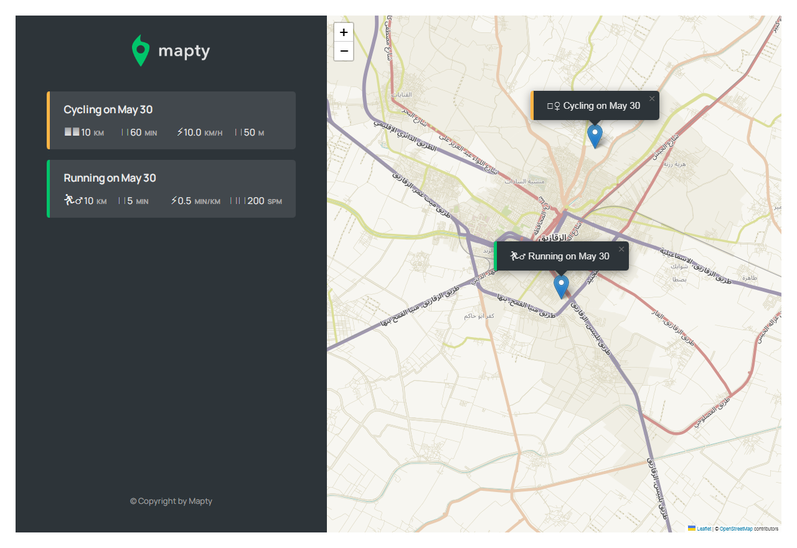

# mapty
A map Application that you can use to organize and track your workouts, this APP is created for learning purposes and for practicing on (OOP, Geolocation, Project planning)

## Feauters in the APP 
- render a map of the user current position 
- user can create a markup for the workouts 
- format the workout with date and kind
- orginize the workouts in a list 
- go to the workout using the list
- save the workouts data in local storage

## DEMO 

## [LIVE DEMO](https://abdelrhman-ahmed-kamal.github.io/mapty/)
